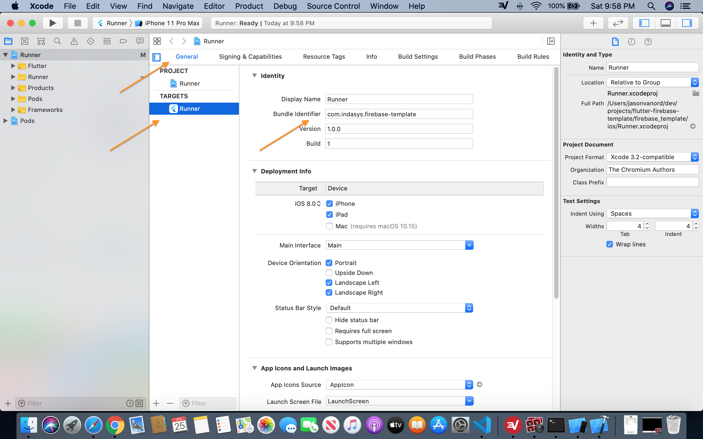
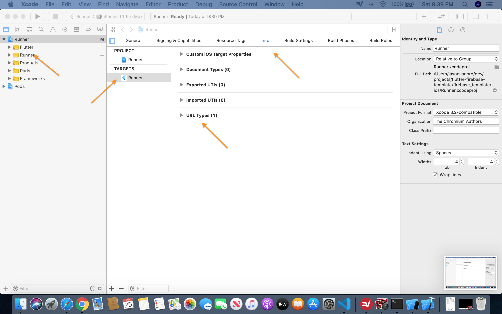

# flutter-firebase-template
A template for a flutter app using BLoC patterns and Firebase as a login provider.

## Getting Started
1. Obviously you'll need to setup a Firebase project for this. You'll probably want to get that started first.
    - On your Firebase console for your project, navigate to Authentication > Sign-in method and enable "Email/Password" and "Google" providers.
1. You could just fork and clone this repository, but that will stick you with a bunch of preset names that you probably won't like. So I recommend starting a fresh project with `flutter create ...` and then copying the contents of "lib" and "test" from this project and then renaming any classes as you see fit.
    - Remember to use `flutter create --org ...` to make your app/package IDs make sense.

:warning: Unfortunately, Firebase authentication doesn't work nicely out-of the box and if your environment isn't configured correctly you'll get app crashes with unhelpful error messages (and that's if you know where to look.) So here's a short list of additional steps that *should* be sufficient to get you to a working template app. Some of these tips can be seen [here](https://codelabs.developers.google.com/codelabs/flutter-firebase/#6) as well.

## Additional Steps Required for iOS
1. On your Firebase console for your project, navigate to Settings > General. Choose "Add app" and follow the prompts for iOS. Make note of the Bundle ID you set here, as it will have to match the Bundle Identifier in your XCode project.
1. Download the GoogleService-Info.plist file for the app you just defined and move it to the "ios/Runner" directory of your flutter project. (This may be a good time to put *.plist in your .gitignore to keep your app secrets safe.) 
1. Open the ios/Runner workspace in XCode. In the General tab of the Runner project, make sure your "Bundle Identifier" is set to the same 

1. While you're in XCode, take the value of REVERSED_CLIENT_ID from GoogleService-Info.plist and add it to your Url Types. Only the text value is needed - like shown [here](https://developers.google.com/identity/sign-in/ios/start-integrating#add_a_url_scheme_to_your_project).

## Additional Steps Required for Android
Unlike in iOS, the app will run in a simulator out of the box. But your login will fail and won't really tell you why until you complete some additional setup.
1. If you're going to use the Google sign-in option you'll need to tell Firebase to use your debug android certificate. Use these steps to get the necessary SHA1 fingerprint that you'll enter while creating your Firebase app. (Doing this first is probably easier, but you can configure the Firebase app first and come back to this).
	- First you'll need to know where your keytool is. It's probably not where you think it is if your JDK was installed with Android Studio and not by direct download or with Eclipse or something. Start by running `flutter doctor -v` in a terminal. Make note of the value of "Java binary at:". Your keytool will be in the same place (just replace "java" with "keytool").
	- Now use your keytool to print the fingerprints of the "androiddebugkey": `"/Applications/Android Studio.app/Contents/jre/jdk/Contents/Home/bin/keytool" -list -v -alias androiddebugkey -keystore ~/.android/debug.keystore` (your path to keytool may differ). When prompted for a password, use "android". Make note of the SHA1 fingerprint.
	- If you have already created your Android app in Firebase, you can now enter the SHA1 fingerprint on the app configuration settings. (Look for something that says "Add fingerprint".) Otherwise keep it secret, keep it safe ... you'll need to ~toss it into the fires of Mount Doom~ add it to your app configuration later.
    - It's worth noting that a similar process will be used for signing your Android app for the Play Store as explained [here](https://flutter.dev/docs/deployment/android) and that you may also need to get a release certificate fingerprint as explained [here](https://developers.google.com/android/guides/client-auth). But you don't need to worry about that just yet.
1. On your Firebase console for your project, navigate to Settings > General. Choose "Add app" and follow the prompts for Android. Make note of the package ID you set here.
    - If you've already created your signing certificate and exported the SHA1 fingerprint you'll enter it here, under App ID and Nickname.
1. Download the google-services.json file and move it to your "android/app" directory in your flutter project. (Probably also a good time to make sure your .gitignore is keeping that file secret.)
1. Now is a good time to make sure your package ID is the same everywhere and that is matches what you used for the Android package ID in Firebase.
    - The "manifest:package" attribute in "android/app/src/main/AndroidManifest.xml", "android/app/src/debug/AndroidManifest.xml", and "android/app/src/profile/AndroidManifest.xml"
    - The "android.defaultConfig.applicationId" property in "android/app/build.gradle"
    - The package directive in "android/app/src/main/MainActivity.kt"
1. Configure Gradle to use the google-service plugin to read the .json file you downloaded
    - Add the line `apply plugin: 'com.google.gms.google-services'` to "android/app/build.gradle" __at the very bottom__. (Take care that you do this on the right build.gradle file - there's more than one.)
    - Add the google-services dependency to "android/build.gradle" (as a "classpath" under "buildscript.dependencies"). Check [here](https://developers.google.com/android/guides/google-services-plugin) for the latest version number. (Again, make sure you're in the right "build.gradle" file.)
1. Run `flutter clean` in a terminal to make sure any cached config gets cleared up

## Other helpful links
- [A guide for using an app-secrets file to store API keys and other things](https://medium.com/@sokrato/storing-your-secret-keys-in-flutter-c0b9af1c0f69)
- [A sample app using Firebase](https://medium.com/flutter-community/building-a-chat-app-with-flutter-and-firebase-from-scratch-9eaa7f41782e)
